### Hi there 👋

I'm mapan

    
    &nbsp;
    

### projects

  
游戏

* MinMax算法 井字棋(tic-tac-toe) [source code](https://github.com/mapan1984/tic-tac-toe.js) / [preview](https://mapan1984.github.io/tic-tac-toe.js/)
* alpha-beta剪枝算法 五子棋(Renju) [source code](https://github.com/mapan1984/Renju) / [preview](https://mapan1984.github.io/Renju/)
* 贪吃蛇(Snake) [source code](https://github.com/mapan1984/Snake) / [preview](https://mapan1984.github.io/Snake/)
* 2048 [source code](https://github.com/mapan1984/2048) / [preview](https://mapan1984.github.io/2048/)
* 俄罗斯方块(Tetris) [source code](https://github.com/mapan1984/Tetris) / [preview](https://mapan1984.github.io/Tetris/)
* 扫雷(minesweeper) [source code](https://github.com/mapan1984/minesweeper) / [preview](https://mapan1984.github.io/minesweeper/)

  
解释器

* brain fuck 解释器(PyBrainFuck) [source code](https://github.com/mapan1984/PyBrainFuck) / [preview](https://github.com/mapan1984/PyBrainFuck)
* brain fuck 解释器(JsBrainFuck) [source code](https://github.com/mapan1984/JsBrainFuck) / [preview](https://mapan1984.github.io/JsBrainFuck/)
* Scheme 解释器(js)(Scmjs) [source code](https://github.com/mapan1984/Scmjs) / [preview](https://mapan1984.github.io/Scmjs/)
* Scheme 解释器(py)(Scmpy) [source code](https://github.com/mapan1984/Scmpy) / [preview](https://scmpy.herokuapp.com/)

  
其他

* IEEE 浮点表示可视化(FloatBits) [source code](https://github.com/mapan1984/FloatBits) / [preview](https://mapan1984.github.io/FloatBits/)
* 寻路算法可视化(PathFinder) [source code](https://github.com/mapan1984/PathFinder) / [preview](https://mapan1984.github.io/PathFinder/)
* 迷宫地图生成(MazeGeneration) [source code](https://github.com/mapan1984/MazeGeneration) / [preview](https://mapan1984.github.io/MazeGeneration/)
* wav 音频生成(riff-wave-pcm) [source code](https://github.com/mapan1984/riff-wave-pcm) / [preview](https://mapan1984.github.io/riff-wave-pcm/)
* 线性拟合(liner-regression) [source code](https://github.com/mapan1984/linear-regression) / [preview](https://mapan1984.github.io/linear-regression/)
* matrix [source code](https://github.com/mapan1984/matrix) / [preview](https://github.com/mapan1984/matrix)
* 立方体(Cube) [source code](https://github.com/mapan1984/Cube) / [preview](https://mapan1984.github.io/Cube/)
* 生成 readme toc [source code](https://github.com/mapan1984/ReadmeTOC)
* game of life [source code](https://github.com/mapan1984/gameOfLife) / [preview](https://mapan1984.github.io/gameOfLife/)
* LangtonAnt [source code](https://github.com/mapan1984/LangtonAnt) / [preview](https://mapan1984.github.io/LangtonAnt/)
* 生成 ASCII 字符画 [source code](https://github.com/mapan1984/ascii-image) / [preview](https://mapan1984.github.io/ascii-image/)

